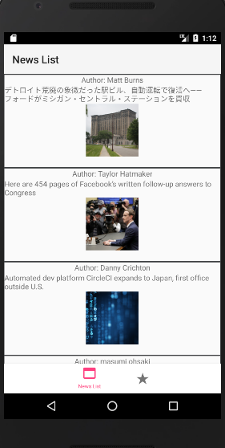

##NerdLive

##App Description
--This app is a tech news viewer that allows you to save an article to your favorites and view it later.

##To Install
--To install this app clone the repo, and in your termianl either enter the command react-native run-ios, or react-native run-android. if you do run-android you need to use android studio's simulator. If you use run-ios you need to use xcodes simulator.

##Contact me
~email: austen.elswick@gmail.com
~linkedin: /in/austenelswick

MIT license
